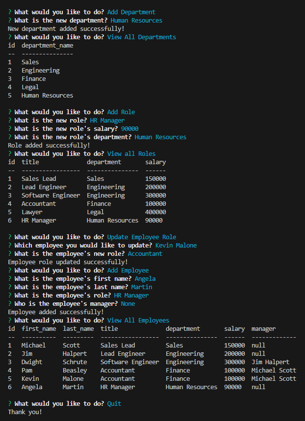

# Employee-Tracker

## Description
This content management system allows users to manage their company's employee database using their command-line. The application starts by asking the user what they would like to accomplish from the following options:
1. View all departments
2. View all roles
3. View all employees
4. Add a department
5. Add a role
6. Add an employee
7. Update an employee's role
8. Quit the application

Choosing any of the view options will display a table to the user with the respective requested data. Whenever the user adds an employee, role, or department, the input data is added to the database and can be seen when viewing their respective tables. Finally, the user can update an employee's role in the database and can view the new information similarly.

## Credit
Thank you to my classmates; Lucas Wysoczanski, Daniel Lee, May Pham, and Joey Lee; for partnering with me to work on this challenge. Here are their GitHub profiles-- Lucas Wysoczanski: https://github.com/LucasWyski001 Daniel Lee: https://github.com/drog41813 May Pham: https://github.com/mayphamx Joey Lee: https://github.com/Rockojoe2

## License
This repository is licensed by MIT. See https://mit-license.org/ to learn more.

## Usage
Watch this walkthrough video: https://drive.google.com/file/d/1Syan3FgzvS3gQWYJTArT-Xlb3R1zpE37/view?usp=sharing

